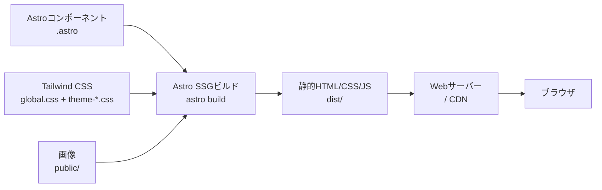
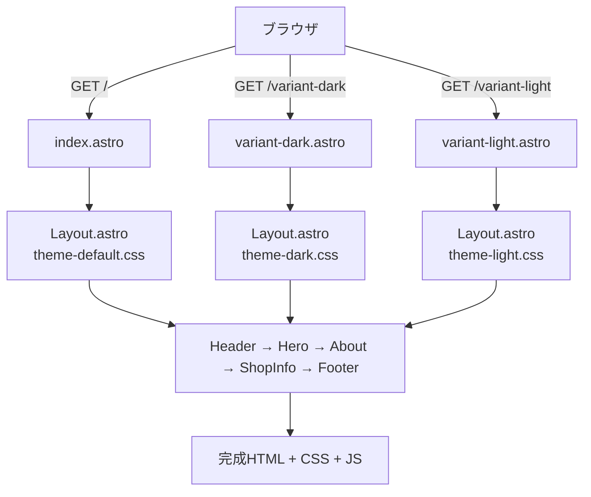
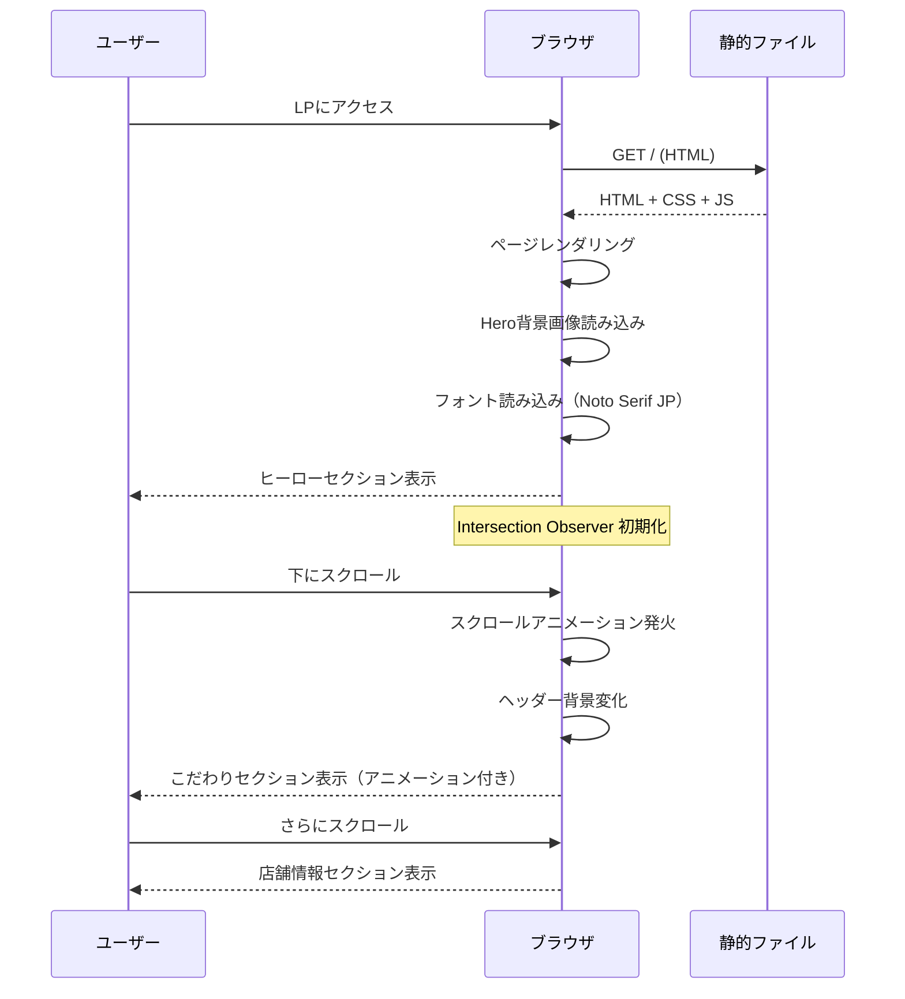
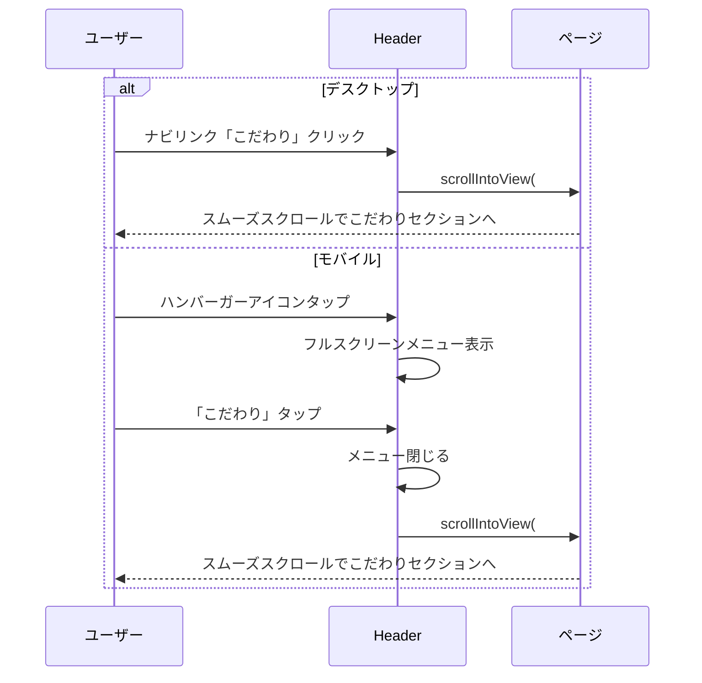
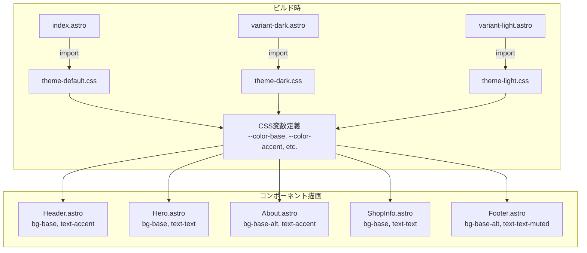
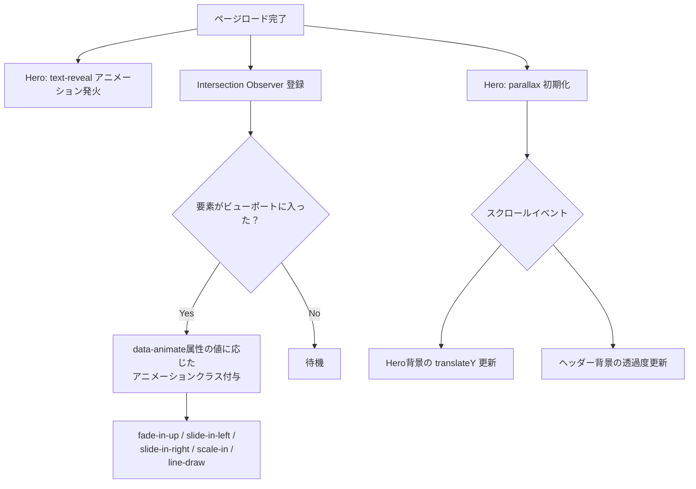

# ラーメンLP データフロー図

**作成日**: 2026-03-14
**関連アーキテクチャ**: [architecture.md](architecture.md)
**関連要件定義**: [requirements.md](../../spec/ramen-lp/requirements.md)

**【信頼性レベル凡例】**:
- 🔵 **青信号**: EARS要件定義書・ユーザヒアリングを参考にした確実なフロー
- 🟡 **黄信号**: EARS要件定義書・ユーザヒアリングから妥当な推測によるフロー
- 🔴 **赤信号**: EARS要件定義書・ユーザヒアリングにない推測によるフロー

---

## ビルド・デプロイフロー 🔵

**信頼性**: 🔵 *要件定義REQ-003・技術スタックより*



## ページレンダリングフロー 🔵

**信頼性**: 🔵 *要件定義REQ-001・REQ-004より*



**詳細ステップ**:
1. ビルド時にAstroが各ページを静的HTMLとして生成
2. 各ページは対応するテーマCSSをインポート
3. Layout.astroが共通のHTML構造（head, body）を提供
4. 各コンポーネントがCSS変数を参照してテーマに応じた色で描画

## ユーザーインタラクションフロー 🔵

**信頼性**: 🔵 *ユーザストーリー1.1, 1.2, 3.1より*

### ページ閲覧フロー



### ナビゲーションフロー 🟡

**信頼性**: 🟡 *既存実装パターンから妥当な推測*



## テーマ適用フロー 🔵

**信頼性**: 🔵 *ユーザヒアリング（3ページ比較方式）より*



## アニメーションフロー 🔵

**信頼性**: 🔵 *ユーザヒアリング（リッチアニメーション）より*



### アニメーションの遅延設計 🟡

**信頼性**: 🟡 *リッチアニメーション要件から妥当な推測*

```
Hero セクション（ページロード時）:
├── 0.0s: 背景画像表示
├── 0.3s: タグライン text-reveal
├── 0.6s: キャッチコピー text-reveal
├── 1.0s: CTAボタン fade-in-up
└── 連続: parallax スクロール連動

こだわりセクション（スクロールトリガー）:
├── 0.0s: セクションタイトル fade-in-up
├── 0.2s: 装飾線 line-draw
├── 0.4s: スープこだわりカード slide-in-left
└── 0.6s: 食材こだわりカード slide-in-right

店舗情報セクション（スクロールトリガー）:
├── 0.0s: セクションタイトル fade-in-up
├── 0.2s: 情報リスト fade-in-up（各項目0.1s遅延）
└── 0.4s: 地図エリア scale-in
```

## 状態管理 🟡

**信頼性**: 🟡 *既存実装パターンから妥当な推測*

静的LPのため、状態管理はクライアントサイドJavaScriptで最小限に行う。

| 状態 | 管理方法 | 用途 |
|------|---------|------|
| モバイルメニュー開閉 | DOMクラス切替（`is-open`） | ハンバーガーメニューの表示/非表示 |
| ヘッダー背景 | scrollイベント + クラス切替 | スクロール位置に応じた背景変化 |
| アニメーション発火済み | Intersection Observer | 一度発火したら監視解除 |

## エラーハンドリング 🔴

**信頼性**: 🔴 *一般的なベストプラクティスからの推測*

| エラーケース | 対処方法 |
|-------------|---------|
| Hero画像読み込み失敗 | CSS `background-color` でフォールバック |
| フォント読み込み失敗 | `font-family` のフォールバック（`serif`） |
| JavaScript無効 | CSS-onlyアニメーション（`@media (prefers-reduced-motion: no-preference)`）、ナビはaタグのデフォルト動作 |

## 関連文書

- **アーキテクチャ**: [architecture.md](architecture.md)
- **要件定義**: [requirements.md](../../spec/ramen-lp/requirements.md)
- **ユーザストーリー**: [user-stories.md](../../spec/ramen-lp/user-stories.md)

## 信頼性レベルサマリー

- 🔵 青信号: 7件 (58%)
- 🟡 黄信号: 3件 (25%)
- 🔴 赤信号: 2件 (17%)

**品質評価**: 高品質
